# MangaNegus System Architecture & Data Flow

**Document ID:** ARCH-2026-001
**Date:** January 22, 2026
**Target System:** MangaNegus Web Application (Frontend & Backend)

---

## 1. High-Level Architecture Overview

MangaNegus operates as a **Single-Page Application (SPA)** frontend communicating with a **Flask (Python)** backend. The backend acts as a unified gateway (proxy) to various third-party manga sources, handling the complexity of anti-bot protections (Cloudflare), parsing, and data normalization.

---

## 2. Visual Data Flow

This diagram illustrates how data travels from the user's browser, through the Flask backend, to external sources, and back.

```mermaid
graph TD
    %% --- FRONTEND LAYER ---
    subgraph Frontend ["🖥️ Browser / Frontend"]
        direction TB
        UI_Index["templates/index.html<br>(User Interface)"]
        MainJS["static/js/main.js<br>(State & Logic)"]
        ReaderJS["static/js/reader.js<br>(Image Viewer)"]
        ReqQueue["RequestQueue<br>(Rate Limiter)"]
        
        UI_Index --> MainJS
        MainJS --> ReqQueue
        MainJS --> ReaderJS
    end

    %% --- NETWORK BOUNDARY ---
    ReqQueue --> |"JSON Request"| Backend_API
    ReaderJS --> |"Image Request"| Backend_Proxy

    %% --- BACKEND LAYER ---
    subgraph Backend ["⚙️ Flask Backend"]
        direction TB
        
        subgraph Routes ["API Routes"]
            Route_Search["manga_api.py<br>(Search Endpoint)"]
            Route_Proxy["main_api.py<br>(Image Proxy)"]
            Route_DL["downloads_api.py<br>(Queue Manager)"]
        end

        subgraph Core ["Core Logic"]
            SmartSearch["search/smart_search.py<br>(Deduplication)"]
            SourceMgr["sources/__init__.py<br>(Source Manager)"]
            SmartSession["sources/http_client.py<br>(Stealth Client)"]
        end
        
        Backend_API["/api/*"] --> Route_Search
        Backend_API --> Route_DL
        Backend_Proxy["/api/proxy/*"] --> Route_Proxy

        Route_Search --> SmartSearch
        SmartSearch --> SourceMgr
        Route_Proxy --> SourceMgr
        Route_DL --> SourceMgr
        
        SourceMgr --> SmartSession
    end

    %% --- EXTERNAL LAYER ---
    subgraph External ["☁️ External Sources"]
        Site_Weeb["WeebCentral"]
        Site_Dex["MangaDex"]
        CDN_Images["Image CDNs"]
    end

    %% --- DATA FLOW ---
    SmartSession --> |"Stealth Request"| Site_Weeb
    SmartSession --> |"API Request"| Site_Dex
    SmartSession --> |"Download Blob"| CDN_Images

    %% --- RETURN FLOW ---
    Site_Weeb --> |"HTML"| SourceMgr
    CDN_Images --> |"Bytes"| Route_Proxy
    Route_Proxy --> |"Stream"| ReaderJS
    SourceMgr --> |"Manga Objects"| Route_Search
    Route_Search --> |"JSON Response"| MainJS
```

---

## 3. Detailed Component Breakdown

### Frontend Files (`static/js/`)

| File | Role | Key Relationships |
| :--- | :--- | :--- |
| **`main.js`** | **The Controller.** Handles routing, state (page navigation, manga selection), and API calls. | Calls `reader.js` when reading starts. Updates DOM in `index.html`. |
| **`reader.js`** | **The Viewer.** Manages the image canvas, zooming, page turning, and prefetching images. | Calls `/api/chapter_pages` for links and `/api/proxy/image` to load them. |
| **`storage.js`** | **The Cache.** Wraps IndexedDB to store Library and History locally for offline support. | Used by `main.js` to save state. |

### Backend Routes (`manganegus_app/routes/`)

| File | Role | Key Relationships |
| :--- | :--- | :--- |
| **`manga_api.py`** | **Search & Info.** Handles finding manga (`/search`) and listing chapters (`/chapters`). | Calls `SourceManager` to query external sites. |
| **`main_api.py`** | **Image Proxy.** Downloads images on the server side to bypass CORS and streams them to the browser. | Uses `SmartSession` to fetch images securely. |
| **`downloads_api.py`** | **Queue Manager.** Handles requests to save chapters as `.cbz` files and triggers background tasks. | Triggers `tasks/downloads.py`. |

### Core Logic (`sources/`)

| File | Role | Key Relationships |
| :--- | :--- | :--- |
| **`__init__.py`** | **Source Manager.** The central registry that knows which sources are available and which one is active. | Is a Singleton (only one instance exists). |
| **`http_client.py`** | **Smart Session.** A specialized client that impersonates a real Chrome browser to bypass anti-bot protections. | Used by ALL source connectors. |
| **`weebcentral_v2.py`** | **Connector.** A specific driver that parses HTML into standardized Manga objects. | Inherits from `BaseConnector`. |

---

## 4. Key Workflows

### Workflow 1: The Smart Search
1.  **Frontend**: `main.js` sends a query to `manga_api.py`.
2.  **Backend**: `manga_api.py` invokes `SmartSearch`.
3.  **Execution**: `SmartSearch` queries multiple sources in parallel.
4.  **Stealth**: Each request uses `SmartSession` to avoid being blocked.
5.  **Deduplication**: Results are merged based on title similarity.
6.  **Response**: A clean JSON list is returned to the UI.

### Workflow 2: Secure Image Loading
1.  **Frontend**: `reader.js` identifies a protected image URL.
2.  **Proxy Request**: The browser requests the image via `/api/proxy/image`.
3.  **Backend Action**: `main_api.py` fetches the image using the correct headers (Referer/User-Agent).
4.  **Delivery**: The server streams the image data directly to the reader.

### Workflow 3: Background Download
1.  **Frontend**: User clicks "Download".
2.  **Queueing**: `downloads_api.py` creates a background task.
3.  **Execution**: `tasks/downloads.py` fetches pages, downloads images, and zips them into a `.cbz` file.
4.  **Status**: The frontend polls for progress and notifies the user upon completion.
